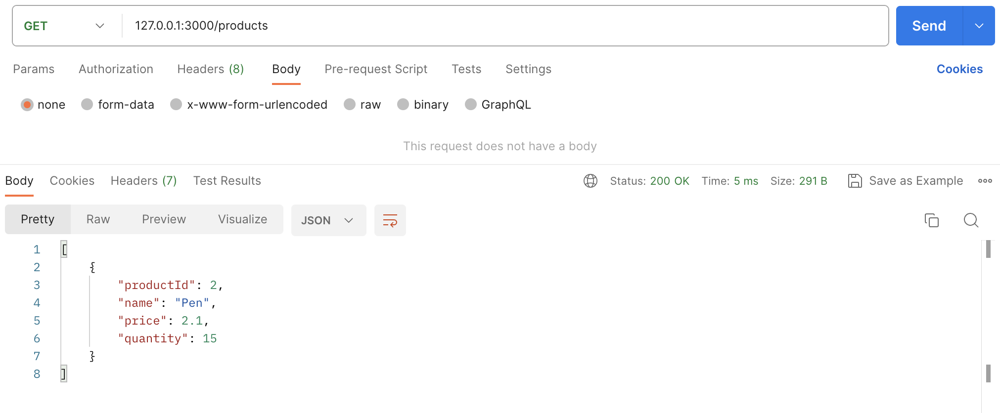
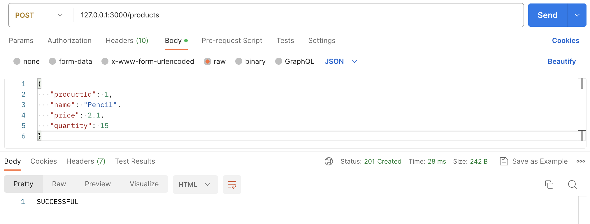
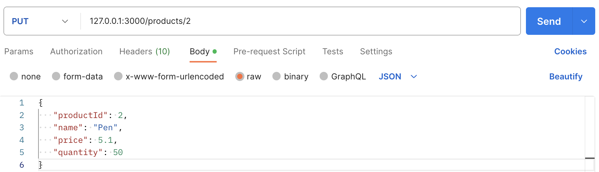
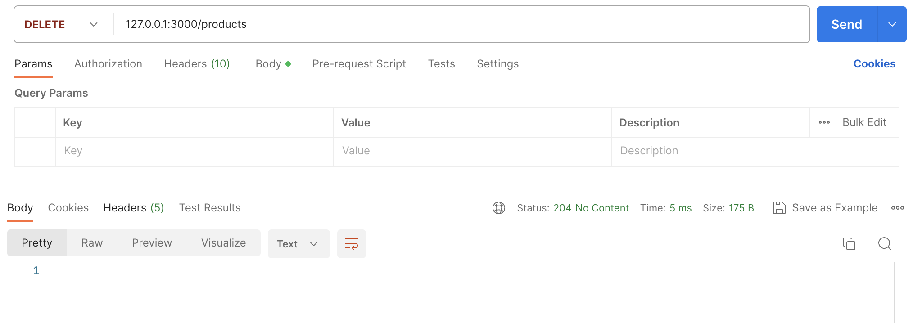

# NodeJS-HTTP-Server
 Node.js HTTP server implemented with Express.js that stores, retrieves and deletes products using
 - GET
 - POST
 - DELETE methods
   
and JSON data format

 ### HOW TO RUN:
1. Install required packages and run HTTP server
```console
npm install
node app.js
```
2. Import https://github.com/EmreDenizz/NodeJS-HTTP-Server/blob/main/postman_collection.json to Postman
- **POST** products data
- **GET** products data
- **DELETE** all products

### SCREENSHOTS:
**GET:**<br/>
<kbd></kbd>

**POST:**<br/>
<kbd></kbd>

**PUT:**<br/>
<kbd></kbd>

**DELETE:**<br/>
<kbd></kbd>
